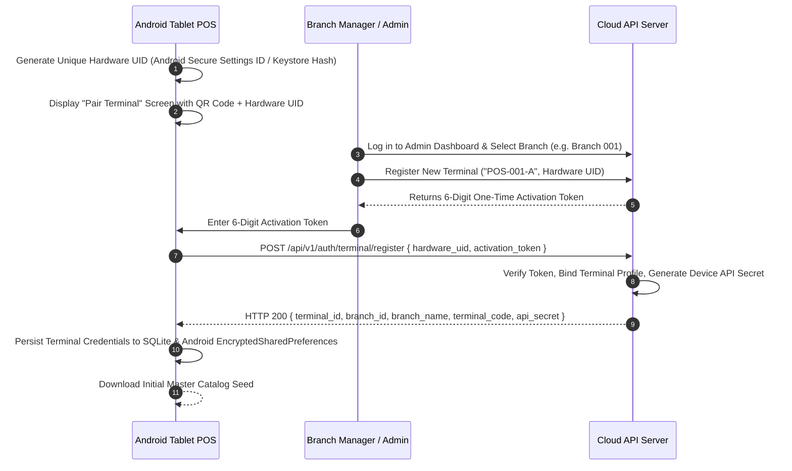

# 03. Multi-Branch and Terminal Structure

## 1. Multi-Branch Topology
FoodBaskets Corp operates **18 distinct branches** across the region. Each branch has its own physical address, tax registration profile, staff roster, localized inventory count, and assigned POS terminals.

```
FoodBaskets Corp Enterprise
 ├── Branch 001 (Main Hub / Downtown)     ── Terminals: POS-001-A, POS-001-B
 ├── Branch 002 (Uptown Commercial)       ── Terminals: POS-002-A, POS-002-B
 ├── Branch 003 (East Market)             ── Terminals: POS-003-A, POS-003-B
 ├── Branch 004 (West District)           ── Terminals: POS-004-A, POS-004-B
 └── Branches 005 through 018             ── Terminals: POS-005-A through POS-018-A (1 each)
     (Total: 18 Branches, 22 POS Terminals)
```

---

## 2. Terminal Registration & Pairing Protocol

Each Android tablet device must be paired with an official Terminal ID before it can process sales or synchronize data.



---

## 3. Invoice Numbering Format

To guarantee zero invoice number collisions across 18 branches and 22 terminals even during 100% offline periods, invoice numbers follow a deterministic, human-readable structured format:

$$\text{INVOICE FORMAT: } \mathbf{BR\text{-}[BranchCode]\text{-}T[TerminalNumber]\text{-}YYYYMMDD\text{-}[SequenceNumber]}$$

### Examples:
- `BR-001-T1-20260902-0001` (Branch 1, Terminal 1, Sept 2, 2026, 1st sale of day)
- `BR-001-T1-20260902-0002` (Branch 1, Terminal 1, Sept 2, 2026, 2nd sale of day)
- `BR-002-T2-20260902-0145` (Branch 2, Terminal 2, Sept 2, 2026, 145th sale of day)

### Invoice Generation Rules:
1. Terminal maintains a local monotonic counter in SQLite: `daily_sequence_counters`.
2. Sequence resets to `0001` at `00:00:00` local time or upon first sale of a new calendar day.
3. Because the `BranchCode` and `TerminalNumber` are permanently embedded in the prefix, no two terminals can ever produce the same invoice number.
