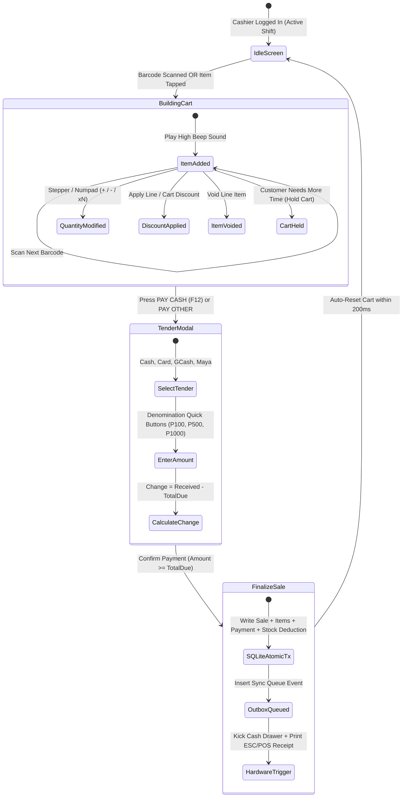

# 05. Sales and Checkout Workflow

## 1. Primary Cashier User Journey
The cashier workflow is built for zero friction, high speed, and minimal touch requirements.

---

## 2. Mathematical Calculation Engine

All prices in FoodBaskets Corp are **VAT-Inclusive (12% standard Philippine VAT)** by default, with statutory exemptions for Senior Citizens and PWDs.

### 2.1 Standard Line Item Calculation
$$\text{Line Gross} = \text{Unit Price} \times \text{Quantity}$$
$$\text{Line Discount} = \begin{cases} \text{Line Gross} \times \frac{\text{Percent}}{100} & \text{if percentage} \\ \text{Fixed Amount} & \text{if fixed} \end{cases}$$
$$\text{Line Net} = \text{Line Gross} - \text{Line Discount}$$

### 2.2 VAT Breakdown (VAT-Inclusive)
$$\text{VATable Sales} = \frac{\text{Line Net}}{1 + \text{VAT Rate}} = \frac{\text{Line Net}}{1.12}$$
$$\text{VAT Amount} = \text{Line Net} - \text{VATable Sales}$$

### 2.3 Senior Citizen / PWD Statutory 20% Discount
Under Philippine Republic Acts (RA 9994 & RA 10754), qualified goods are exempt from 12% VAT, and a 20% discount is applied to the net VAT-exempt base:
$$\text{VAT-Exempt Base} = \frac{\text{Line Gross}}{1.12}$$
$$\text{Senior/PWD 20\% Discount} = \text{VAT-Exempt Base} \times 0.20$$
$$\text{Final Payable Amount} = \text{VAT-Exempt Base} - \text{Senior/PWD Discount}$$

---

## 3. Cart Hold and Recall Engine
When a customer forgets their wallet or steps away:
1. Cashier presses **Hold Sale (F4)**.
2. The current cart items, customer notes, and discounts are serialized and saved to SQLite `held_carts`.
3. The main register screen resets immediately for the next customer in line.
4. When the customer returns, cashier presses **Recall (F5)**, views list of held tickets with timestamps and item counts, and restores the cart with 1 tap.
