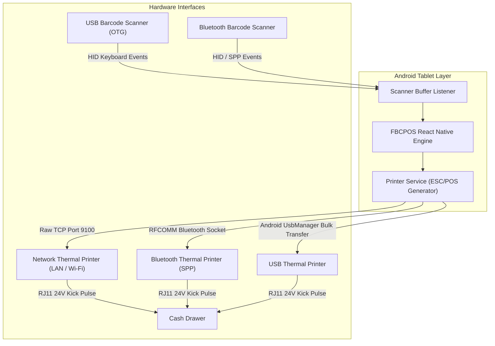

# 08. Receipt Generation, ESC/POS & Hardware Integration

## 1. Hardware Communication Architecture



---

## 2. Standard 80mm ESC/POS Receipt Layout

```
                  FOODBASKETS CORP
              Branch 001 - Downtown Hub
          123 Rizal Avenue, Manila, PH
               VAT REG TIN: 123-456-789-000
           Tel: (02) 8123-4567 / 0917-000-0000

================================================
INVOICE #: BR-001-T1-20260902-0042
DATE: 2026-09-02 17:15:30    CASHIER: Maria Santos
TERMINAL: POS-001-A           SHIFT: #104
================================================
ITEM                      QTY    PRICE    TOTAL
------------------------------------------------
Fresh Whole Milk 1L         2    95.00   190.00
Whole Wheat Bread 500g      1    65.00    65.00
Organic Eggs 12s            1   145.00   145.00
Canned Tuna Flakes 180g     3    45.00   135.00
------------------------------------------------
SUBTOTAL                                 535.00
DISCOUNT (Senior/PWD 20%)                -23.88
VAT EXEMPT SALES                         119.42
VATABLE SALES (12%)                      370.54
12% VAT                                   44.46
------------------------------------------------
TOTAL AMOUNT DUE                        P487.26
================================================
PAYMENT SUMMARY
CASH RECEIVED:                          P500.00
CHANGE:                                  P12.74
================================================
           THANK YOU FOR SHOPPING WITH US!
        Please keep this receipt for returns.
              Accreditation #: FBC-2026-01
```

---

## 3. ESC/POS Command Reference Byte Sequences

```typescript
export const ESC_POS = {
  INIT: [0x1b, 0x40],                     // ESC @ : Initialize printer
  ALIGN_LEFT: [0x1b, 0x61, 0x00],         // ESC a 0 : Left align
  ALIGN_CENTER: [0x1b, 0x61, 0x01],       // ESC a 1 : Center align
  ALIGN_RIGHT: [0x1b, 0x61, 0x02],        // ESC a 2 : Right align
  EMPHASIZE_ON: [0x1b, 0x45, 0x01],       // ESC E 1 : Bold on
  EMPHASIZE_OFF: [0x1b, 0x45, 0x00],      // ESC E 0 : Bold off
  DOUBLE_SIZE_ON: [0x1d, 0x21, 0x11],     // GS ! 0x11 : Double height & width
  DOUBLE_SIZE_OFF: [0x1d, 0x21, 0x00],    // GS ! 0x00 : Normal size
  FEED_AND_CUT: [0x1d, 0x56, 0x41, 0x03], // GS V 65 3 : Feed 3 lines & cut
  KICK_DRAWER: [0x1b, 0x70, 0x00, 0x19, 0xfa], // ESC p 0 25 250 : Drawer pulse pin 2 (50ms ON)
};
```
